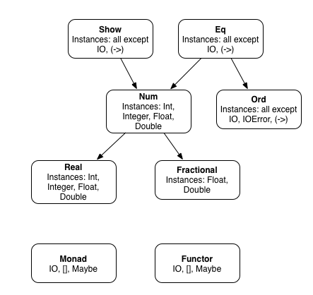

# Tutorial on Pure Haskell Programming

Pure Haskell code has no side effects and if written properly is easy to read and understand. I am assuming that you have installed *stack* using the directions in Appendix A. It is important to keep a Haskell interactive **repl** open as you read the material in this book and experiment with the code examples as you read. I don't believe that you will be able to learn the material in this chapter unless you work along trying the examples and experimenting with them in an open Haskell repl!

The directory **Pure** in the git repository contains the examples for this chapter. Many of the examples contain a small bit of impure code in a **main** function. We will cover how this impure code works in the next chapter but let's look at a short example of impure code that is contained inside a **main** function:

{lang="haskell",linenos=off}
~~~~~~~~
main = do
  putStrLn ("1 + 2 = " ++ show (1 + 2))
~~~~~~~~

The function **main** is the entry point of this short two line program. When the program is run, the main function will be executed.

Here the function **main** uses the **do** notation to execute a single IO action, but **do** can also execute a sequence of actions that can use impure Haskell code (i.e., code with side effects - as we cover in the next chapter). The **putStrLn** function prints a string to the console. The printed string is constructed by concatenating three parts: "1 + 2 = ", the result of the expression 1 + 2 (which is 3), and the string representation of this result, which is obtained by calling the function **show**.

It's worth noting that **putStrLn** writes a string to the standard output and also writes a new line character to the console. In general, the function **show** is used to convert any value to a string, here it is converting the result of 1+2 to string to concatenate it with the previous string.

Pure Haskell code performs no I/O, network access, access to shared in-memory data structures, etc.

The first time you build an example program with *stack* it may take a while since library dependencies need to be loaded from the web. In each example directory, after an initial **stack build** or **stack ghci** (to run the repl) then you should not notice this delay.

## Interactive GHCi Shell

The interactive shell (often called a "repl") is very useful for learning Haskell: understanding types and the value of expressions. While simple expressions can be typed directly into the GHCi shell, it is usually better to use an external text editor and load Haskell source files into the shell (repl). Let's get started. Assuming that you have installed *stack* as described in Appendix A, please try:

{lang="haskell",line-numbers=on}
~~~~~~~~
~/$ cd haskell_tutorial_cookbook_examples/Pure
~/haskell_tutorial_cookbook_examples/Pure$ stack ghci
Using main module: Package `Pure' component exe:Simple with main-is file: /home/markw/BITBUCKET/haskell_tutorial_cookbook_examples/Pure/Simple.hs
Configuring GHCi with the following packages: Pure
GHCi, version 7.10.3: http://www.haskell.org/ghc/  :? for help
[1 of 1] Compiling Main             ( /home/markw/BITBUCKET/haskell_tutorial_cookbook_examples/Pure/Simple.hs, interpreted )
Ok, modules loaded: Main.
*Main> 1 + 2
3
*Main> (1 + 2)
3
*Main> :t (1 + 2)
(1 + 2) :: Num a => a
*Main> :l Simple.hs
[1 of 1] Compiling Main             ( Simple.hs, interpreted )
Ok, modules loaded: Main.
*Main> main
1 + 2 = 3
*Main> 
~~~~~~~~

If you are working in a repl and edit a file you just loaded with **:l**, you can then reload the last file loaded using **:r** without specifying the file name. This makes it quick and easy to edit a Haskell file with an external editor like Emacs or Vi and reload it in the repl after saving changes to the current file.

Here we have evaluated a simple expression "1 + 2" in line 10. Notice that in line 12 we can always place parenthesis around an expression without changing its value. We will use parenthesis when we need to change the default orders of precedence of functions and operators and make the code more readable.

In line 14 we are using the ghci **:t** command to show the type of the expression **(1 + 2)**. The type **Num** is a type class (i.e., a more general purpose type that other types can inherit from) that contains several sub-types of numbers. As examples, two subtypes of **Num** are **Fractional** (e.g., 3.5) and **Integer** (e.g., 123). Type classes provide a form of function overloading since existing functions can be redefined to handle arguments that are instances of new classes.

In line 16 we are using the ghci command **:l** to load the external file *Simple.hs*. This file contains a function called **main** so we can execute **main** after loading the file. The contents of *Simple.hs* is:

{lang="haskell",linenos=on}
~~~~~~~~
module Main where

sum2 x y = x + y

main = do
  putStrLn ("1 + 2 = " ++ show (sum2 1 2))
~~~~~~~~

Line 1 defines a module named **Main**. The rest of this file is the definition of the module. This form of the module **do** expression exports all symbols so other code loading this module has access to **sum2** and **main**. The function **sum2** takes two arguments, **x** and **y**, and returns their sum, **x + y**. If we only wanted to export **main** then we could use:

{lang="haskell",linenos=off}
~~~~~~~~
module Main (main) where
~~~~~~~~

The function **sum2** takes two arguments and adds them together. I didn't define the type of this function so Haskell does it for us using type inference.

{lang="haskell",line-numbers=on}
~~~~~~~~
*Main> :l Simple.hs 
[1 of 1] Compiling Main             ( Simple.hs, interpreted )
Ok, modules loaded: Main.
*Main> :t sum2
sum2 :: Num a => a -> a -> a
*Main> sum2 1 2
3
*Main> sum2 1.0 2
3.0
*Main> :t 3.0
3.0 :: Fractional a => a
*Main> :t 3
3 :: Num a => a
*Main> (toInteger 3)
3
*Main> :t (toInteger 3)
(toInteger 3) :: Integer
*Main> 
~~~~~~~~

What if you want to build a standalone executable program from the example in **Simple.hs**? Here is an example:

{linenos=on}
~~~~~~~~
$ stack ghc Simple.hs
[1 of 1] Compiling Main             ( Simple.hs, Simple.o )
Linking Simple ...
$ ./Simple 
1 + 2 = 3
~~~~~~~~

Most of the time we will use simple types built into Haskell: **characters**, **strings**, **lists**, and **tuples**. The type **Char** is a single character. One type of string is a list of characters **[Char]**. (Another type **ByteString** will be covered in later chapters.) Every element in a list must have the same type. A **Tuple** is like a list but elements can be different types. Here is a quick introduction to these types, with many more examples later:

{lang="haskell",linenos=on}
~~~~~~~~
*Main> :t 's'
's' :: Char
*Main> :t "tree"
"tree" :: [Char]
*Main> 's' : "tree"
"stree"
*Main> :t "tick"
"tick" :: [Char]
*Main> 's' : "tick"
"stick"
*Main> :t [1,2,3,4]
[1,2,3,4] :: Num t => [t]
*Main> :t [1,2,3.3,4]
[1,2,3.3,4] :: Fractional t => [t]
*Main> :t ["the", "cat", "slept"]
["the", "cat", "slept"] :: [[Char]]
*Main> ["the", "cat", "slept"] !! 0
"the"
*Main> head ["the", "cat", "slept"]
"the"
*Main> tail ["the", "cat", "slept"]
["cat","slept"]
*Main> ["the", "cat", "slept"] !! 1
"cat"
*Main> :t (20, 'c')
(20, 'c') :: Num t => (t, Char)
*Main> :t (30, "dog")
(30, "dog") :: Num t => (t, [Char])
*Main> :t (1, "10 Jackson Street", 80211, 77.5)
(1, "10 Jackson Street", 80211, 77.5)
  :: (Fractional t2, Num t, Num t1) => (t, [Char], t1, t2)
~~~~~~~~

The GHCi repl command **:t** tells us the type of any expression or function. Much of your time developing Haskell will be spent with an open repl and you will find yourself checking types many times during a development session.

In line 1 you see that the type of **'s'** is **'s' :: Char** and in line 3 that the type of the string "tree" is **[Char]** which is a list of characters. The abbreviation **String** is defined for **[Char]**; you can use either. In line 9 we see the "cons" operator **:** used to prepend a character to a list of characters. The cons **:** operator works with all types contained in any lists. All elements in a list must be of the same type.

The type of the list of numbers **[1,2,3,4]** in line 11 is **[1,2,3,4] :: Num t => [t]**. The type **Num** is a general number type. The expression **Num t => [t]** is read as: "*t* is a type variable equal to **Num** and the type of the list is **[t]**, or a list of Num values". It bears repeating: all elements in a list must be of the same type. The functions **head** and **tail** used in lines 19 and 21 return the first element of a list and return a list without the first element.

You will use lists frequently but the restriction of all list elements being the same type can be too restrictive so Haskell also provides a type of sequence called **tuple** whose elements can be of different types as in the examples in lines 25-31.

Tuples of length 2 are special because functions **fst** and **snd** are provided to access the first and second pair value:

{lang="haskell",linenos=off}
~~~~~~~~
*Main> fst (1, "10 Jackson Street")
1
*Main> snd (1, "10 Jackson Street")
"10 Jackson Street"
*Main> :info fst
fst :: (a, b) -> a 	-- Defined in ‘Data.Tuple’
*Main> :info snd
snd :: (a, b) -> b 	-- Defined in ‘Data.Tuple’
~~~~~~~~

Please note that **fst** and **snd** will not work with tuples that are not of length 2. Also note that if you use the function **length** on a tuple, the result is always one because of the way tuples are defined as Foldable types, which we will use later.

Haskell provides a concise notation to get values out of long tuples. This notation is called destructuring:

{lang="haskell",linenos=on}
~~~~~~~~
*Main> let geoData = (1, "10 Jackson Street", 80211, 77.5)
*Main> let (_,_,zipCode,temperature) = geoData 
*Main> zipCode 
80211
*Main> temperature 
77.5
~~~~~~~~

Here, we defined a tuple **geoData** with values: index, street address, zip code, and temperature. In line two we extract the zip code and temperature. Another reminder: we use **let** in lines 1-2 because we are in a repl.

Like all programming languages, Haskell has operator precedence rules as these examples show:

{lang="haskell",line-numbers=on}
~~~~~~~~
*Main> 1 + 2 * 10
21
*Main> 1 + (2 * 10)
21
*Main> length "the"
3
*Main> length "the" + 10
13
*Main> (length "the") + 10
13
~~~~~~~~

The examples in lines 1-4 illustrate that the multiplication operator has a higher precedence than the addition operator.

{lang="haskell",line-numbers=off}
~~~~~~~~
*Main> :t length
length :: Foldable t => t a -> Int
*Main> :t (+)
(+) :: Num a => a -> a -> a
~~~~~~~~

Note that the function **length** starts with a lower case letter. All Haskell functions start with a lower case letter except for type constructor functions that we will get to later. A **Foldable** type can be iterated through and be processed with map functions (which we will use shortly).

We saw that the function **+** acts as an infix operator. We can convert infix functions to prefix functions by enclosing them in parenthesis:

{lang="haskell",line-numbers=off}
~~~~~~~~
*Main> (+) 1 2
3
*Main> div 10 3
3
*Main> 10 `div` 3
3
~~~~~~~~

In this last example we also saw how a prefix function **div** can be used infix by enclosing it in back tick characters.

{lang="haskell",line-numbers=on}
~~~~~~~~
*Main> let x3 = [1,2,3]
*Main> x3
[1,2,3]
*Main> let x4 = 0 : x3
*Main> x4
[0,1,2,3]
*Main> x3 ++ x4
[1,2,3,0,1,2,3]
*Main> x4
[0,1,2,3]
*Main> x4 !! 0
0
*Main> x4 !! 100
*** Exception: Prelude.!!: index too large
*Main> let myfunc1 x y = x ++ y
*Main> :t myfunc1
myfunc1 :: [a] -> [a] -> [a]
*Main> myfunc1 x3 x4
[1,2,3,0,1,2,3]
~~~~~~~~

Usually we define functions in files and load them as we need them. Here is the contents of the file myfunc1.hs:

{lang="haskell",linenos=on}
~~~~~~~~
myfunc1 :: [a] -> [a] -> [a]
myfunc1 x y = x ++ y
~~~~~~~~

The first line is a type signature for the function and is not required; here the input arguments are two lists and the output is the two lists concatenated together. In line 1 note that **a** is a type variable that can represent any type. However, all elements in the two function input lists and the output list are constrained to be the same type.

{lang="haskell",line-numbers=on}
~~~~~~~~
*Main> :l myfunc1.hs 
[1 of 1] Compiling Main             ( myfunc1.hs, interpreted )
Ok, modules loaded: Main.
*Main> myfunc1 ["the", "cat"] ["ran", "up", "a", "tree"]
["the","cat","ran","up","a","tree"]
~~~~~~~~

Please note that the *stack* repl auto-completes using the tab character. For example, when I was typing in ":l myfunc1.hs" I actually just typed ":l myf" and then hit the tab character to complete the file name. Experiment with auto-completion, it will save you a lot of typing. In the following example, for instance, after defining the variable **sentence** I can just type "se" and the tab character to auto-complete the entire variable name:

{lang="haskell",line-numbers=on}
~~~~~~~~
*Main> let sentence = myfunc1 ["the", "cat"] ["ran", "up", "a", "tree"]
*Main> sentence 
["the","cat","ran","up","a","tree"]
~~~~~~~~

The function **head** returns the first element in a list and the function **tail** returns all but the first elements in a list:

{lang="haskell",line-numbers=on}
~~~~~~~~
*Main> head sentence 
"the"
*Main> tail sentence 
["cat","ran","up","a","tree"]
~~~~~~~~

We can create new functions from existing arguments by supplying few arguments, a process known as "currying":

{lang="haskell",line-numbers=on}
~~~~~~~~
*Main> let p1 = (+ 1)
*Main> :t p1
p1 :: Num a => a -> a
*Main> p1 20
21
~~~~~~~~

In this last example the function **+** takes two arguments but if we only supply one argument a function is returned as the value: in this case a function that adds 1 to an input value.

We can also create new functions by *composing* existing functions using the infix function **.** that when placed between two function names produces a new function that combines the two functions. Let's look at an example that uses **.** to combine the partial function **(+ 1)** with the function **length**:

{lang="haskell",line-numbers=on}
~~~~~~~~
*Main> let lengthp1 = (+ 1) . length
*Main> :t lengthp1
lengthp1 :: Foldable t => t a -> Int
*Main> lengthp1 "dog"
4
~~~~~~~~

Note the order of the arguments to the inline function **.**: the argument on the right side is the first function that is applied, then the function on the left side of the **.** is applied.

This is the second example where we have seen the type **Foldable** which means that a type can be mapped over, or iterated over. We will look at Haskell types in the next section.

## Introduction to Haskell Types

This is a good time to spend more time studying Haskell types. We will see more material on Haskell types throughout this book so this is just an introduction using the **data** expression to define a Type **MyColors** defined in the file **MyColors.hs**:

{lang="haskell",linenos=on}
~~~~~~~~
data MyColors = Orange | Red | Blue | Green | Silver
 deriving (Show)
~~~~~~~~

This code defines a new data type in Haskell named **MyColors** that has five values: **Orange**, **Red**, **Blue**, **Green** or **Silver**. The keyword **data** is used to define a new data type, and the "|" symbol is used to separate the different possible values (also known as constructors) of the type.

The **deriving (Show)** clause at the end of the line tells the compiler to automatically generate an implementation of the **Show** type class for the **MyColors** type. In other words, we are asking the Haskell compiler to automatically generate a function **show** that can convert a value to a string. **show** is a standard function and in general we want it defined for all types. **show** converts an instance to a string value. This allows instances of **MyColors** to be converted to strings using the function **show**.

The **MyColors** type defined here is an enumeration (i.e., it is a fixed set of values), it's an algebraic data type with no associated fields. This means that the type **MyColors** can only take one of the five values defined: **Orange**, **Red**, **Blue**, **Green** or **Silver**. There is another way to think about this. This code defines a new data type called **MyColors** with five constructors **Orange**, **Red**, **Blue**, **Green** or **Silver**.

{lang="haskell",line-numbers=on}
~~~~~~~~
Prelude> :l colors.hs 
[1 of 1] Compiling Main             ( colors.hs, interpreted )
Ok, modules loaded: Main.
*Main> show Red
"Red"
*Main> let c1 = Green
*Main> c1
Green
*Main> :t c1
c1 :: MyColors
*Main> Red == Green

<interactive>:60:5:
    No instance for (Eq MyColors) arising from a use of ‘==’
    In the expression: Red == Green
    In an equation for ‘it’: it = Red == Green
~~~~~~~~

What went wrong here? The infix function **==** checks for equality and we did not define equality functions for our new type. Let's fix the definition in the file colors.hs:

{lang="haskell",linenos=on}
~~~~~~~~
data MyColors = Orange | Red | Blue | Green | Silver
 deriving (Show, Eq)
~~~~~~~~

Because we are deriving **Eq** we are also asking the compiler to generate code to see if two instances of this class are equal. If we wanted to be able to order our colors then we would also derive **Ord**.
 
Now our new type has **show**, **==**, and **/=** (inequality) defined:

{lang="haskell",line-numbers=on}
~~~~~~~~
Prelude> :l colors.hs 
[1 of 1] Compiling Main             ( colors.hs, interpreted )
Ok, modules loaded: Main.
*Main> Red == Green
False
*Main> Red /= Green
True
~~~~~~~~

Let's also now derive **Ord** to have the compile generate a default function **compare** that operates on the type **MyColors**:

{lang="haskell",linenos=on}
~~~~~~~~
data MyColors = Orange | Red | Blue | Green | Silver
 deriving (Show, Eq, Ord)
~~~~~~~~

Because we are now deriving **Ord** the compiler will generate functions to calculate relative ordering for values of type **MyColors**. Let's experiment with this:

{lang="haskell",line-numbers=on}
~~~~~~~~
*Main> :l MyColors.hs 
[1 of 1] Compiling Main             ( MyColors.hs, interpreted )
Ok, modules loaded: Main.
*Main> :t compare
compare :: Ord a => a -> a -> Ordering
*Main> compare Green Blue
GT
*Main> compare Blue Green
LT
*Main> Orange < Red
True
*Main> Red < Orange
False
*Main> Green < Red
False
*Main> Green < Silver
True
*Main> Green > Red
True
~~~~~~~~

Notice that the compiler generates a **compare** function for the type **MyColors** that orders values by the order that they appear in the **data** expression. What if you wanted to order them in string sort order? This is very simple: we will remove **Ord** from the deriving clause and define our own function **compare** for type **MyColors** instead of letting the compiler generate it for us:

{lang="haskell",line-numbers=on}
~~~~~~~~
data MyColors = Orange | Red | Blue | Green | Silver
 deriving (Show, Eq)
          
instance Ord MyColors where
  compare c1 c2 = compare (show c1) (show c2)
~~~~~~~~

In line 5 I am using the function **show** to convert instances of **MyColors** to strings and then the version of **compare** that is called in line 5 is the version the compiler wrote for us because we derived **Show**. Now the ordering is in string ascending sort order because we are using the **compare** function that is supplied for the type **String**:

{lang="haskell",line-numbers=on}
~~~~~~~~
*Main> :l MyColors.hs 
[1 of 1] Compiling Main             ( MyColors.hs, interpreted )
Ok, modules loaded: Main.
*Main> Green > Red
False
~~~~~~~~

Our new type MyColors is a simple type. Haskell also supports hierarchies of types called **Type** **Classes** and the type we have seen earlier **Foldable** is an example of a type class that other types can inherit from. For now, consider sub-types of **Foldable** to be collections like lists and trees that can be iterated over.

I want you to get in the habit of using **:type** and **:info** (usually abbreviated to **:t** and **:i**) in the GHCi repl. Stop reading for a minute now and type **:info Ord** in an open repl. You will get a lot of output showing you all of the types that **Ord** is defined for. Here is a small bit of what gets printed:

{lang="haskell",line-numbers=on}
~~~~~~~~
*Main> :i Ord
class Eq a => Ord a where
  compare :: a -> a -> Ordering
  (<) :: a -> a -> Bool
  (<=) :: a -> a -> Bool
  (>) :: a -> a -> Bool
  (>=) :: a -> a -> Bool
  max :: a -> a -> a
  min :: a -> a -> a
  	-- Defined in ‘ghc-prim-0.4.0.0:GHC.Classes’
instance Ord MyColors -- Defined at MyColors.hs:4:10
instance (Ord a, Ord b) => Ord (Either a b)
  -- Defined in ‘Data.Either’
instance Ord a => Ord [a]
  -- Defined in ‘ghc-prim-0.4.0.0:GHC.Classes’
instance Ord Word -- Defined in ‘ghc-prim-0.4.0.0:GHC.Classes’
instance Ord Ordering -- Defined in ‘ghc-prim-0.4.0.0:GHC.Classes’
instance Ord Int -- Defined in ‘ghc-prim-0.4.0.0:GHC.Classes’
instance Ord Float -- Defined in ‘ghc-prim-0.4.0.0:GHC.Classes’
instance Ord Double -- Defined in ‘ghc-prim-0.4.0.0:GHC.Classes’
~~~~~~~~

Lines 1 through 8 show you that **Ord** is a subtype of **Eq** that defines functions **compare**, **max**, and **min** as well as the four operators **<**, **<=**, **>=**, and **>=**. When we customized the **compare** function for the type **MyColors**, we only implemented **compare**. That is all that we needed to do since the other operators rely on the implementation of **compare**.

Once again, I ask you to experiment with the example type **MyColors** in an open GHCi repl:

{lang="haskell",line-numbers=on}
~~~~~~~~
*Main> :t max
max :: Ord a => a -> a -> a
*Main> :t Green
Green :: MyColors
*Main> :i Green
data MyColors = ... | Green | ... 	-- Defined at MyColors.hs:1:39
*Main> max Green Red
Red
~~~~~~~~

The following diagram shows a partial type hierarchy of a few types included in the standard Haskell Prelude (this is derived from the [Haskell Report at haskell.org](https://www.haskell.org/onlinereport/basic.html)):

{width=60%}

Here you see that type **Num** and **Ord** are sub-types of type **Eq**, **Real** is a sub-type of **Num**, etc. We will see the types **Monad** and **Functor** in the next chapter.

## Functions Are Pure

Again, it is worth pointing out that Haskell functions do not modify their inputs values. The common pattern is to pass immutable values to a function and modified values are returned. As a first example of this pattern we will look at the standard function **map** that takes two arguments: a function that converts a value of any type **a** to another type **b**, and a list of type **a**. Functions that take other functions as arguments are called **higher** **order** **functions**. The result is another list of the same length whose elements are of type **b** and the elements are calculated using the function passed as the first argument. Let's look at a simple example using the function **(+ 1)** that adds 1 to a value:

{lang="haskell",line-numbers=on}
~~~~~~~~
*Main> :t map
map :: (a -> b) -> [a] -> [b]
*Main> map (+ 1) [10,20,30]
[11,21,31]
*Main> map (show . (+ 1)) [10,20,30]
["11","21","31"]
~~~~~~~~

In the first example, types **a** and **b** are the same, a **Num**. The second example used a composed function that adds 1 and then converts the example to a string. Remember: the function **show** converts a Haskell data value to a string. In this second example types **a** and **b** are different because the function is mapping a number to a string.

The directory *haskell_tutorial_cookbook_examples/Pure*  contains the examples for this chapter. We previously used the example file *Simple.hs*. Please note that in the rest of this book I will omit the git repository top level directory name haskell_tutorial_cookbook_examples and just specify the sub-directory name:

{lang="haskell",line-numbers=on}
~~~~~~~~
module Main where

sum2 x y = x + y

main = do
  putStrLn ("1 + 2 = " ++ show (sum2 1 2))
~~~~~~~~

Please note that the last two lines of this listing is not pure code since we are creating a side effect of printing data. We will cover impure code in the next chapter but for now we briefly review to **do** construct:

In Haskell, the **do** construct, especially when used with **main = do**, serves as a way to sequence multiple IO actions (operations that interact with the external world) in a clear and readable manner. It's syntactic sugar that makes it easier to work with monads, particularly the IO monad.

Types of Impure Code Allowed within a do block:

- Input/Output (I/O): Reading from files (readFile), writing to files (writeFile, appendFile), interacting with the console (getLine, putStrLn), and network communication.
- State Management: Using monads like State or ST to manage mutable state within a purely functional context.
- Exceptions: Handling runtime errors using functions like catch or try.
- Foreign Function Interface (FFI): Calling external C libraries or interacting with other languages.
- Concurrency: Spawning threads or using other concurrency primitives.
- Time-related operations: Getting the current time, introducing delays, or working with timeouts.
- Randomness: Generating random numbers or performing other non-deterministic actions.

Essentially, any operation that has side effects or interacts with the world outside the pure functional realm of Haskell is considered impure and typically needs to be performed within the context of a do block or using other monadic constructs.

For now let's just look at the mechanics of executing this file without using the REPL (started with *stack* **ghci**). We can simply build and run this example using *stack*, which is covered in some detail in Appendix A:

{line-numbers=off}
~~~~~~~~
stack build --exec Simple
~~~~~~~~

This command builds the project defined in the configuration files *Pure.cabal* and *stack.yaml* (the format and use of these files is briefly covered in detail in Appendix A and there is more [reference material here](https://docs.haskellstack.org/en/stable/yaml_configuration/)). This example defines two functions: **sum2** and **main**. **sum2** is a pure Haskell function with no state, no interaction with the outside world like file IO, etc., and no non-determinism. **main** is an impure function, and we will look at impure Haskell code in some detail in the next chapter. As you might guess the output of this code snippet is

{lang="haskell",line-numbers=off}
~~~~~~~~
1 + 2 = 3
~~~~~~~~

To continue the tutorial on using pure Haskell functions, once again we will use *stack* to start an interactive repl during development:

{lang="haskell",line-numbers=on}
~~~~~~~~
markw@linux:~/haskell_tutorial_cookbook_examples/Pure$ stack ghci
*Main> :t 3
3 :: Num a => a
*Main> :t "dog"
"dog" :: [Char]
*Main> :t main
main :: IO ()
*Main> 
~~~~~~~~

In this last listing I don't show the information about your Haskell environment and the packages that were loaded. In repl listings in the remainder of this book I will continue to edit out this Haskell environment information for brevity. 

Line 4 shows the use of the repl shortcut *:t* to print out the type of a string which is an array of [Char], and the type of the function **main** is of type **IO Action**, which we will explain in the next chapter. An IO action contains impure code where we can read and write files, perform a network operation, etc. and we will look at **IO Action** in the next chapter.

## Using Parenthesis or the Special **$** Character and Operator Precedence

We will look at operator and function precedence and the use of the **$** character to simplify using parenthesis in expessions. By the way, in Haskell there is not much difference between operators and function calls except operators like **+**, etc. which are by default infix while functions are usually prefix. So except for infix functions that are enclosed in backticks (e.g., **10 `div` 3**) Haskell usually uses prefix functions: a function followed by zero or more arguments. You can also use **$** that acts as an opening parenthesis with a not-shown closing parenthesis at the end of the current expression (which may be multi-line). Here are some examples:

{lang="haskell",linenos=on}
~~~~~~~~
*Main> print (3 * 2)
6
*Main> print $ 3 * 2
6
*Main> last (take 10 [1..])
10
*Main> last $ take 10 [1..]
10
*Main> ((take 10 [1..]) ++ (take 10 [1000..]))
[1,2,3,4,5,6,7,8,9,10,1000,1001,1002,1003,1004,1005,1006,1007,1008,1009]
*Main> take 10 [1..] ++ take 10 [1000..]
[1,2,3,4,5,6,7,8,9,10,1000,1001,1002,1003,1004,1005,1006,1007,1008,1009]
*Main> 1 + 2 * (4 * 5)
41
*Main> 2 * 3 + 10 * 30
306
~~~~~~~~

I use the GHCi command **:info** (**:i** is an abbreviation) to check both operator precedence and the function signature if the operator is converted to a function by enclosing it in parenthessis:

{lang="haskell",linenos=on}
~~~~~~~~
*Main> :info *
class Num a where
  ...
  (*) :: a -> a -> a
  ...
  	-- Defined in ‘GHC.Num’
infixl 7 *
*Main> :info +
class Num a where
  (+) :: a -> a -> a
  ...
  	-- Defined in ‘GHC.Num’
infixl 6 +
*Main> :info `div`
class (Real a, Enum a) => Integral a where
  ...
  div :: a -> a -> a
  ...
  	-- Defined in ‘GHC.Real’
infixl 7 `div`
*Main> :i +
class Num a where
  (+) :: a -> a -> a
  ...
  	-- Defined in ‘GHC.Num’
infixl 6 +
~~~~~~~~

Notice how **+** has lower precedence than *.

Just to be clear, understand how operators are used as functions and also how functions can be used as infix operators:

{lang="haskell",linenos=on}
~~~~~~~~
*Main> 2 * 3
6
*Main> (*) 2 3
6
*Main> 10 `div` 3
3
*Main> div 10 3
3
~~~~~~~~

Especially when you are just starting to use Haskell it is a good idea to also use **:info** to check the type signatures of standard functions that you use. For example:

{lang="haskell",linenos=on}
~~~~~~~~
*Main> :info last
last :: [a] -> a 	-- Defined in ‘GHC.List’
*Main> :info map
map :: (a -> b) -> [a] -> [b] 	-- Defined in ‘GHC.Base’
~~~~~~~~

## Lazy Evaluation

Haskell is referred to as a *lazy* *language*.

In lazy evaluation, expressions are not evaluated until their results are absolutely necessary for the program's execution. This contrasts with eager evaluation, where expressions are evaluated as soon as they are encountered, regardless of whether their values are immediately needed.

Benefits of Lazy Evaluation

- Efficiency: By delaying computations until necessary, lazy evaluation can avoid performing unnecessary work, potentially leading to more efficient programs.
- Flexibility: Lazy evaluation allows you to work with infinite data structures and perform operations on them without worrying about the entire structure being computed at once. Only the parts that are actually accessed will be evaluated.

Consider the following example:

{lang="haskell",linenos=on}
~~~~~~~~
$ stack ghci
*Main> [0..10]
[0,1,2,3,4,5,6,7,8,9,10]
*Main> take 11 [0..]
[0,1,2,3,4,5,6,7,8,9,10]
*Main> let xs = [0..]
*Main> :sprint xs
xs = _
*Main> take 5 xs
[0,1,2,3,4]
*Main> :sprint xs
xs = _
*Main> 
~~~~~~~~

In line 2 we are creating a list with 11 elements. In line 4 we are doing two things:

- Creating an infinitely long list containing ascending integers starting with 0.
- Fetching the first 11 elements of this infinitely long list. It is important to understand that in line 4 only the first 11 elements are generated because that is all the **take** function requires.

In line 6 we are assigning another infinitely long list to the variable **xs** but the value of **xs** is unevaluated and a placeholder is stored to calculate values as required. In line 7 we use GHCi's **:sprint** command to show a value without evaluating it. The output in line 8 **_** indicated that the expression has yet to be evaluated.

Lines 9 through 12 remind us that Haskell is a functional language: the **take** function used in line 9 does not change the value of its argument so **xs** as seen in lines 10 and 12 is still unevaluated.

## Understanding List Comprehensions

Effectively using list comprehensions makes your code shorter, easier to understand, and easier to maintain. Let's start out with a few GHCi repl examples. You will learn a new GHCi repl trick in this section: entering multiple line expressions by using **:{** and **:}** to delay evaluation until an entire expression is entered in the repl (listings in this section are reformatted to fit the page width):

{lang="haskell",linenos=on}
~~~~~~~~
*Main> [x | x <- ["cat", "dog", "bird"]]
["cat","dog","bird"]
*Main> :{
*Main| [(x,y) | x <- ["cat", "dog", "bird"],
*Main|          y <- [1..2]]
*Main| :}
[("cat",1),("cat",2),("dog",1),("dog",2),("bird",1),("bird",2)]
~~~~~~~~

The list comprehension on line 1 assigns the elements of the list **["cat", "dog", "bird"]** one at a time to the variable **x** and then collects all these values of **x** in a list value that is the value of the list comprehension. The list comprehension in line 1 is hopefully easy to understand but when we bind and collect multiple variables the situation, as seen in the example in lines 4 and 5, is not as easy to understand. The thing to remember is that the first variable gets iterated as an "outer loop" and the second variable is iterated as the "inner loop." List comprehensions can use many variables and the iteration ordering rule is the same: last variable iterates first, etc.

{lang="haskell",linenos=off}
~~~~~~~~
*Main> :{
*Main| [(x,y) | x <- [0..3],
*Main|          y <- [1,3..10]]
*Main| :}
[(0,1),(0,3),(0,5),(0,7),(0,9),(1,1),(1,3),(1,5),(1,7),
 (1,9),(2,1),(2,3),(2,5),(2,7),(2,9),(3,1),(3,3),(3,5),
 (3,7),(3,9)]
*Main> [1,3..10]
[1,3,5,7,9]
~~~~~~~~

In this last example we are generating all combinations of [0..3] and [1,3..10] and storing the combinations as two element tuples. You could also store then as lists:

{lang="haskell",linenos=of}
~~~~~~~~
*Main> [[x,y] | x <- [1,2], y <- [10,11]]
[[1,10],[1,11],[2,10],[2,11]]
~~~~~~~~

List comprehensions can also contain filtering operations. Here is an example with one filter:

{lang="haskell",linenos=on}
~~~~~~~~
*Main> :{
*Main| [(x,y) | x <- ["cat", "dog", "bird"],
*Main|          y <- [1..10],
*Main|          y `mod` 3 == 0]
*Main| :}
[("cat",3),("cat",6),("cat",9),
 ("dog",3),("dog",6),("dog",9),
 ("bird",3),("bird",6),("bird",9)]
~~~~~~~~

Here is a similar example with two filters (we are also filtering out all possible values of **x** that start with the character 'd'):

{lang="haskell",linenos=on}
~~~~~~~~
*Main> :{
*Main| [(x,y) | x <- ["cat", "dog", "bird"],
*Main|          y <- [1..10],
*Main|          y `mod` 3 == 0,
*Main|          x !! 0 /= 'd']
*Main| :}
[("cat",3),("cat",6),("cat",9),("bird",3),("bird",6),("bird",9)]
~~~~~~~~

For simple filtering cases I usually use the **filter** function but list comprehensions are more versatile. List comprehensions are extremely useful - I use them frequently.

Lists are instances of the class **Monad** that we will cover in the next chapter (check out the section "List Comprehensions Using the **do** Notation").

List comprehensions are powerful. I would like to end this section with another trick that does not use list comprehensions for building lists of tuple values: using the **zip** function:

{lang="haskell",linenos=on}
~~~~~~~~
*Main> let animals = ["cat", "dog", "bird"]
*Main> zip [1..] animals
[(1,"cat"),(2,"dog"),(3,"bird")]
*Main> :info zip
zip :: [a] -> [b] -> [(a, b)] 	-- Defined in ‘GHC.List’
~~~~~~~~

The function **zip** is often used in this way when we have a list of objects and we want to operate on the list while knowing the index of each element.

## Haskell Rules for Indenting Code

When a line of code is indented relative to the previous line of code, or several lines of code with additional indentation, then the indented lines act as if they were on the previous line. In other words, if code that should all be on one line must be split to multiple lines, then use indentation as a signal to the Haskell compiler.

Indentation of continuation lines should be uniform, starting in the same column. Here are some examples of good code, and code that will not compile:

{lang="haskell",linenos=on}
~~~~~~~~
  let a = 1    -- good 
      b = 2    -- good
      c = 3    -- good
      
  let
    a = 1        -- good 
    b = 2        -- good
    c = 3        -- good
  in a + b + c   -- good

  let a = 1    -- will not compile (bad) 
       b = 2   -- will not compile (bad)
      c = 3    -- will not compile (bad)
      
  let
      a = 1    -- will not compile (bad) 
      b = 2    -- will not compile (bad)
     c = 3     -- will not compile (bad)

  let {
      a = 1;    -- compiles but bad style (good) 
        b = 2;  -- compiles but bad style (good)
      c = 3;    -- compiles but bad style (good)
    } 
~~~~~~~~

If you use *C* *style* braces and semicolons to mark end of expressions, then indenting does not matter as seen in lines 20 through 24. Otherwise, uniform indentation is a hint to the compiler.

The same indenting rules apply to other types of **do** expressions which we will see throughout this book for **do**, **if**, and other types of **do** expressions.
 

## Understanding **let** and **where**

At first glance, **let** and **where** seem very similar in that they allow us to create temporary variables used inside functions. As the examples in the file *LetAndWhere.hs* show, there are important differences.
  
In the following code notice that when we use **let** in pure code inside a function, we then use **in** to indicate the start of an expression to be evaluated that uses any variables defined in a **let** expression. Inside a **do** code block the **in** token is not needed and will cause a parse error if you use it. **do** code blocks are a syntactic sugar for use in impure Haskell code and we will use it frequently later in the book.

You also do not use **in** inside a list comprehension as seen in the function **testLetComprehension** in the next code listing:

{lang="haskell",linenos=on}
~~~~~~~~
module Main where

funnySummation w x y z =
  let bob = w + x
      sally = y + z
  in bob + sally

testLetComprehension =
  [(a,b) | a <- [0..5], let b = 10 * a]

testWhereBlocks a =
  z * q
    where
      z = a + 2
      q = 2

functionWithWhere n  =
  (n + 1) * tenn
  where
    tenn = 10 * n
          
main = do
  print $ funnySummation 1 2 3 4
  let n = "Rigby"
  print n
  print testLetComprehension
  print $ testWhereBlocks 11
  print $ functionWithWhere 1
~~~~~~~~

Compare the **let** **do** expressions starting on line 4 and 24. The first **let** occurs in pure code and uses **in** to define one or more **do** expressions using values bound in the **let**. In line 24 we are inside a monad, specifically using the **do** notation and here **let** is used to define pure values that can be used later in the **do** **do** expression.

Loading the last code example and running the **main** function produces the following output:

{lang="haskell",linenos=on}
~~~~~~~~
*Main> :l LetAndWhere.hs 
[1 of 1] Compiling Main             ( LetAndWhere.hs, interpreted )
Ok, modules loaded: Main.
*Main> main
10
"Rigby"
[(0,0),(1,10),(2,20),(3,30),(4,40),(5,50)]
26
20
~~~~~~~~

This output is self explanatory except for line 7 that is the result of calling **testLetComprehension** that returns an example list comprehension **[(a,b)|a<-[0..5],letb=10*a]**

## Conditional **do** Expressions and Anonymous Functions

The examples in the next three sub-sections can be found in *haskell_tutorial_cookbook_examples/Pure/Conditionals.hs*. You should read the following sub-sections with this file loaded (some GHCi repl output removed for brevity):

{lang="haskell",linenos=on}
~~~~~~~~
haskell_tutorial_cookbook_examples/Pure$ stack ghci
*Main> :l Conditionals.hs 
[1 of 1] Compiling Main             ( Conditionals.hs, interpreted )
Ok, modules loaded: Main.
*Main> 
~~~~~~~~

### Simple Pattern Matching

We previously used the built-in functions **head** that returns the first element of a list and **tail** that  returns a list with the first element removed. We will define these functions ourselves using what is called wild card pattern matching. It is common to append the single quote character **'** to built-in functions when we redefine them so we name our new functions **head'** and **tail'**. Remember when we used destructuring to access elements of a tuple? Wild card pattern matching is similar:

{lang="haskell",linenos=off}
~~~~~~~~
head'(x:_)  = x
tail'(_:xs) = xs
~~~~~~~~

The underscore character **_** matches anything and ignores the matched value. Our **head** and **tail** definitions work as expected:

{lang="haskell",linenos=on}
~~~~~~~~
*Main> head' ["bird","dog","cat"]
"bird"
*Main> tail' [0,1,2,3,4,5]
[1,2,3,4,5]
*Main> :type head'
head' :: [t] -> t
*Main> :t tail'
tail' :: [t] -> [t]
~~~~~~~~

Of course we frequently do not want to ignore matched values. Here is a contrived example that expects a list of numbers and doubles the value of each element. As for all of the examples in this chapter, the following function is *pure*: it can not modify its argument(s) and always returns the same value given the same input argument(s):

{lang="haskell",linenos=on}
~~~~~~~~
doubleList [] = []
doubleList (x:xs) = (* 2) x : doubleList xs
~~~~~~~~

In line 1 we start by defining a pattern to match the empty list. It is necessary to define this *terminating* condition because we are using recursion in line 2 and eventually we reach the end of the input list and make the recursive call **doubleList []**. If you leave out line 1 you then will see a runtime error like "Non-exhaustive patterns in function doubleList." As a Haskell beginner you probably hate Haskell error messages and as you start to write your own functions in source files and load them into a GHCi repl or compile them, you will initially probably hate compilation error messages also. I ask you to take on faith a bit of advice: Haskell error messages and warnings will end up saving you a lot of effort getting your code to work properly. Try to develop the attitude "Great! The Haskell compiler is helping me!" when you see runtime errors and compiler errors.

In line 2 notice how I didn't need to use extra parenthesis because of the operator and function application precedence rules.

{lang="haskell",linenos=on}
~~~~~~~~
*Main> doubleList [0..5]
[0,2,4,6,8,10]
*Main> :t doubleList 
doubleList :: Num t => [t] -> [t]
~~~~~~~~

This function **doubleList** seems very unsatisfactory because it is so specific. What if we wanted to triple or quadruple the elements of a list? Do we want to write two new functions? You might think of adding an argument that is the multiplier like this:

{lang="haskell",linenos=on}
~~~~~~~~
bumpList n [] = []
bumpList n (x:xs) = n * x : bumpList n xs
~~~~~~~~

is better, being more abstract and more general purpose. However, we will do much better.

Before generalizing the list manipuation process further, I would like to make a comment on coding style, specifically on not using unneeded parenthesis. In the last exmple defining **bumpList** if you have superfluous parenthesis like this:

{lang="haskell",linenos=off}
~~~~~~~~
bumpList n (x:xs) = (n * x) : bumpList (n xs)
~~~~~~~~

then the code still works correctly and is fairly readable. I would like you to get in the habit of avoiding extra unneeded parenthesis and one tool for doing this is running **hlint** (installing **hlint** is covered in Appendix A) on your Haskell code. Using **hlint** source file will provide warnings/suggestions like this:

{lang="haskell",linenos=off}
~~~~~~~~
haskell_tutorial_cookbook_examples/Pure$ hlint Conditionals.hs
Conditionals.hs:7:21: Warning: Redundant bracket
Found:
  ((* 2) x) : doubleList (xs)
Why not:
  (* 2) x : doubleList (xs)

Conditionals.hs:7:43: Error: Redundant bracket
Found:
  (xs)
Why not:
  xs
~~~~~~~~

**hlint** is not only a tool for improving your code but also for teaching you how to better program using Haskell. Please note that **hlint** provides other suggestions for *Conditionals.hs* that I am ignoring that mostly suggest that I replace our mapping operations with using the built-in **map** function and use functional composition. The sample code is specifically to show examples of pattern matching and is not as concise as it could be.

Are you satisfied with the generality of the function **bumpList**? I hope that you are not! We should write a function that will apply an arbitrary function to each element of a list. We will call this function **map'** to avoid confusing our **map'** function with the built-in function **map**.

The following is a simple implementation of a map function (we will see Haskell's standard map functions in the next section):

{lang="haskell",linenos=on}
~~~~~~~~
map' f [] = []
map' f (x:xs) = f x : map' f xs
~~~~~~~~

In line 2 we do not need parenthesis around **f x** because function application has a higher precedence than the operator **:** which adds an element to the beginning of a list.

Are you pleased with how concise this definition of a map function is? Is concise code like **map'** readable to you? Speaking as someone who has written hundreds of thousands of lines of Java code for customers, let me tell you that I love the conciseness and readability of Haskell! I appreciate the Java ecosystem with many useful libraries and frameworks and augmented like fine languages like Clojure and JRuby, but in my opinion using Haskell is a more enjoyable and generally more productive language and programming environment.

Let's experiment with our **map'** function:

{lang="haskell",linenos=on}
~~~~~~~~
*Main> map' (* 7) [0..5]
[0,7,14,21,28,35]
*Main> map' (+ 1.1) [0..5]
[1.1,2.1,3.1,4.1,5.1,6.1]
*Main>  map' (\x -> (x + 1) * 2) [0..5]
[2,4,6,8,10,12]
~~~~~~~~

Lines 1 and 3 should be understandable to you: we are creating a partial function like **(* 7)** and passing it to **map'** to apply to the list **[0..5]**.

The syntax for the function in line 5 is called an *anonymous* *function*. Lisp programers, like myself, refer to this as a lambda expression. In any case, I often prefer using *anonymous* *functions* when a function will not be used elsewhere. In line 5 the argument to the anonymous inline function is **x** and the body of the function is **(x + 1) * 2**.

I do ask you to not get carried away with using too many anonymous inline functions because they can make code a little less readable. When we put our code in modules, by default every symbol (like function names) in the module is externally visible. However, if we explicitly export symbols in a module **do** expression then only the explicitly exported symbols are visible by other code that uses the module. Here is an example:

{lang="haskell",linenos=off}
~~~~~~~~
module Test2 (doubler) where

map' f [] = []
map' f (x:xs) = (f x) : map' f xs

testFunc x = (x + 1) * 2

doubler xs = map' (* 2) xs
~~~~~~~~

In this example **map'** and **testFunc** are hidden: any other module that imports **Test2** only has access to **doubler**. It might help for you to think of the exported functions roughly as an interface for a module.

### Pattern Matching With Guards

We will cover two important concepts in this section: using guard pattern matching to make function definitions shorter and easier to read and we will look at the **Maybe** type and how it is used. The **Maybe** type is mostly used in non-pure Haskell code and we will use it heavily later. The Maybe type is a Monad (covered in the next chapter). I introduce the **Maybe** type here since its use fits naturally with guard patterns.

Guards are more flexible than the pattern matching seen in the last section. I use pattern matching for simple cases of destructuring data and guards when I need the flexibility. You may want to revisit the examples in the last section after experimenting with and understanding the examples seen here.

The examples for this section are in the file *Guards.hs*. As a first simple example we will implement the Ruby language "spaceship operator":

{lang="haskell",linenos=on}
~~~~~~~~
spaceship n
  | n < 0     = -1
  | n == 0    = 0
  | otherwise = 1
~~~~~~~~

Notice on line 1 that we do not use an **=** in the function definition when using guards. Each guard starts with **|**, contains a condition, and a value on the right side of the **=** sign.

{lang="haskell",linenos=on}
~~~~~~~~
*Main> spaceship (-10)
-1
*Main> spaceship 0
0
*Main> spaceship 17
1
~~~~~~~~

Remember that a literal negative number as seen in line 1 must be wrapped in parenthesis, otherwise the Haskell compiler will interpret **-** as an operator.

### Case Expressions

Case **do** expressions match a value against a list of possible values. It is common to use the wildcard matching value **_** at the end of a case expression which can be of any type. Here is an example in the file *Cases.hs*:

{lang="haskell",linenos=on}
~~~~~~~~
module Main where

numberOpinion n = 
  case n of
    0 -> "Too low"
    1 -> "just right"
    _ -> "OK, that is a number"
    
main = do
  print $ numberOpinion 0
  print $ numberOpinion 1
  print $ numberOpinion 2
~~~~~~~~

The code in lines 3-7 defines the function **numberOpinion** that takes a single argument "n". We use a **case** expression to match the value of **n** against several possible cases. Each of these cases is defined using the **->** operator, followed by an expression to be evaluated if the case is matched.

The first case, **0 -> 'Too low'** matches the value of **n** against 0, if the value of "n" is 0, the function will return the string "Too low". The second case, **1 -> 'just right'** matches the value of **n** against 1, if the value of **n** is 1, the function will return the string "just right".
The last case is different in that it is a *catch all* case using the **_** as a wild card match. So, **_ -> 'OK, that is a number'** matches any other values of **n**: if the value of **nn** is not 0 or 1 the function will return the string "OK, that is a number".

### If Then Else expressions

Haskell has **if** **then** **else** syntax built into the language - **if** is not defined as a function. Personally I do not use **if** **then** **else** in Haskell very often. I mostly use simple pattern matching and guards. Here are some short examples from the file *IfThenElses.hs*:

{lang="haskell",linenos=off}
~~~~~~~~
ageToString age =
  if age < 21 then "minor" else "adult"
~~~~~~~~

All **if** statements must have both a **then** expression and a **else** expression.

{lang="haskell",linenos=off}
~~~~~~~~
haskell_tutorial_cookbook_examples/Pure$ stack ghci
*Main> :l IfThenElses.hs 
[1 of 1] Compiling Main             ( IfThenElses.hs, interpreted )
Ok, modules loaded: Main.
*Main> ageToString 15
"minor"
*Main> ageToString 37
"adult"
~~~~~~~~

## Maps

Maps are simple to construct using a list of key-value tuples and are by default immutable. There is an example using mutable maps in the next chapter.

We will look at the module **Data.Map** first in a GHCi repl, then later in a few full code examples. There is something new in line 1 of the following listing: I am assigning a short alias **M** to the module **Data.Map**. In referencing a function like **fromList** (which converts a list of tuples to a map) in the **Data.Map** module I can use **M.fromList** instead of **Data.Map.fromList**. This is a common practice so when you read someone else's Haskell code, one of the first things you should do when reading a Haskell source file is to make note of the module name abbreviations at the top of the file.

{lang="haskell",linenos=on}
~~~~~~~~
haskell_tutorial_cookbook_examples/Pure$ stack ghci
*Main> import qualified Data.Map as M
*Main M> :t M.fromList
M.fromList :: Ord k => [(k, a)] -> M.Map k a
*Main M> let aTestMap = M.fromList [("height", 120), ("weight", 15)]
*Main M> :t aTestMap 
aTestMap :: Num a => M.Map [Char] a
*Main M> :t lookup
lookup :: Eq a => a -> [(a, b)] -> Maybe b
*Main M> :t M.lookup
M.lookup :: Ord k => k -> M.Map k a -> Maybe a
*Main M> M.lookup "weight" aTestMap 
Just 15
*Main M> M.lookup "address" aTestMap 
Nothing
~~~~~~~~

The keys in a map must all be the same type and the values are also constrained to be of the same type. I almost always create maps using the helper function **fromList** in the module **Data.Maps**. We will only be using this method of map creation in later examples in this book so I am skipping coverage of other map building functions. I refer you to the [Data.Map documentation](https://www.stackage.org/haddock/lts-6.17/containers-0.5.6.2/Data-Map.html).

The following example shows one way to use the **Just** and **Nothing** return values:

{lang="haskell",linenos=on}
~~~~~~~~
module MapExamples where

import qualified Data.Map as M -- from library containers

aTestMap = M.fromList [("height", 120), ("weight", 15)]

getNumericValue key aMap =
  case M.lookup key aMap of
    Nothing -> -1
    Just value -> value

main = do
  print $ getNumericValue "height" aTestMap
  print $ getNumericValue "age" aTestMap
~~~~~~~~

The function **getNumericValue** shows one way to extract a value from an instance of type **Maybe**. The function **lookup** returns a **Maybe** value and in this example I use a **case** statement to test for a **Nothing** value or extract a wrapped value in a **Just** instance. Using **Maybe** in Haskell is a better alternative to checking for **null** values in *C* or *Java*.

The output from running the **main** function in module **MapExamples** is:

{lang="haskell",linenos=on}
~~~~~~~~
haskell_tutorial_cookbook_examples/Pure$ stack ghci
*Main> :l MapExamples.hs 
[1 of 1] Compiling MapExamples      ( MapExamples.hs, interpreted )
Ok, modules loaded: MapExamples.
*MapExamples> main
120
-1
~~~~~~~~

## Sets

The documentation of **Data.Set.Class** can [be found here](https://www.stackage.org/haddock/lts-6.17/sets-0.0.5/Data-Set-Class.html) and contains overloaded functions for the types of sets defined [here](https://www.stackage.org/package/sets).

For most of my work and for the examples later in this book, I create immutable sets from lists and the only operation I perform is checking to see if a value is in the set. The following examples in GHCI repl are what you need for the material in this book:

{lang="haskell",linenos=on}
~~~~~~~~
*Main> import qualified Data.Set as S 
*Main S> let testSet = S.fromList ["cat","dog","bird"]
*Main S> :t testSet
testSet :: S.Set [Char]
*Main S> S.member "bird" testSet
True
*Main S> S.member "snake" testSet
False
~~~~~~~~

Sets and Maps are immutable so I find creating maps using a lists of key-value tuples and creating sets using lists is fine. That said, coming from the mutable Java, Ruby, Python, and Lisp programming languages, it took me a while to get used to immutability in Haskell.

## More on Functions

In this section we will review what you have learned so far about Haskell functions and then look at a few more complex examples.

We have been defining and using simple functions and we have seen that operators behave like infix functions. We can make operators act as prefix functions by wrapping them in parenthesis:

{lang="haskell",linenos=off}
~~~~~~~~
*Main> 10 + 1
11
*Main> (+) 10 1
11
~~~~~~~~

and we can make functions act as infix operators:

{lang="haskell",linenos=off}
~~~~~~~~
*Main> div 100 9
11
*Main> 100 `div` 9
11
~~~~~~~~

This back tick function to operator syntax works with functions we write also:

{lang="haskell",linenos=off}
~~~~~~~~
*Main> let myAdd a b = a + b
*Main> :t myAdd 
myAdd :: Num a => a -> a -> a
*Main> myAdd 1 2
3
*Main> 1 `myAdd` 2
3
~~~~~~~~

Because we are working in a GHCi repl, in line 1 we use **let** to define the function **myAdd**. If you defined this function in a file and then loaded it, you would not use a **let**. 

In the map examples where we applied a function to a list of values, so far we have used functions that map input values to the same return type, like this (using both partial function evaluation and anonymous inline function):

{lang="haskell",linenos=off}
~~~~~~~~
*Main> map (* 2) [5,6]
[10,12]
*Main> map (\x -> 2 * x) [5,6]
[10,12]
~~~~~~~~

We can also map to different types; in this example we map from a list of **Num** values to a list containing sub-lists of **Num** values:

{lang="haskell",linenos=on}
~~~~~~~~
*Main> let makeList n = [0..n]
*Main> makeList 3
[0,1,2,3]
*Main> map makeList [2,3,4]
[[0,1,2],[0,1,2,3],[0,1,2,3,4]]
~~~~~~~~

As usual, I recommend that when you work in a GHCi repl you check the types of functions and values you are working with:

{lang="haskell",linenos=on}
~~~~~~~~
*Main> :t makeList 
makeList :: (Enum t, Num t) => t -> [t]
*Main> :t [1,2]
[1,2] :: Num t => [t]
*Main> :t [[0,1,2],[0,1,2,3],[0,1,2,3,4]]
[[0,1,2],[0,1,2,3],[0,1,2,3,4]] :: Num t => [[t]]
*Main> 
~~~~~~~~

In line 2 we see that for any type **t** the function signature is **t -> [t]** where the compiler determines that **t** is constrained to be a **Num** or **Enum** by examining how the input variable is used as a range parameter for constructing a list. Let's make a new function that works on any type:

{lang="haskell",linenos=on}
~~~~~~~~
*Main> let make3 x = [x,x,x]
*Main> :t make3
make3 :: t -> [t]
*Main> :t make3 "abc"
make3 "abc" :: [[Char]]
*Main> make3 "abc"
["abc","abc","abc"]
*Main> make3 7.1
[7.1,7.1,7.1]
*Main> :t make3 7.1
make3 7.1 :: Fractional t => [t]
~~~~~~~~

Notice in line 3 that the function **make3** takes any type of input and returns a list of elements the same type as the input. We used **makes3** both with a string argument and a fractional (floating point) number) argument.

## Comments on Dealing With Immutable Data and How to Structure Programs

If you program in other programming languages that use mutable data then expect some feelings of disorientation initially when starting to use Haskell. It is common in other languages to maintain the state of a computation in an object and to mutate the value(s) in that object.  While I cover mutable state in the next chapter the common pattern in Haskell is to create a data structure (we will use lists in examples here) and pass it to functions that return a new modified copy of the data structure as the returned value from the function. It is very common to keep passing the modified new copy of a data structure through a series of function calls. This may seem cumbersome when you are starting to use Haskell but quickly feels natural.

The following example shows a simple case where a list is constructed in the function **main** and passed through two functions **doubleOddElements** and **times10Elements**:

{lang="haskell",linenos=on}
~~~~~~~~
module ChainedCalls where
  
doubleOddElements =
  map (\x -> if x `mod` 2 == 0 then x else 2 * x)

times10Elements = map (* 10)
    
main = do
  print $ doubleOddElements [0,1,2,3,4,5,6,7,8]
  let aList = [0,1,2,3,4,5]
  let newList = times10Elements $ doubleOddElements aList
  print newList
  let newList2 = (times10Elements . doubleOddElements) aList
  print newList2
~~~~~~~~

Notice that the expressions being evaluated in lines 11 and 13 are the same. In line 11 we are applying function **doubleOddElements** to the value of **aList** and passing this value to the outer function **times10Elements**. In line 13 we are creating a new function from composing two existing functions: **times10Elements . doubleOddElements**. The parenthesis in line 13 are required because the **.** operator has lower precedence than the application of function **doubleOddElements** so without the parenthesis line 13 would evaluate as **times10Elements (doubleOddElements aList)** which is not what I intended and would throw an error.

The output is:

{lang="haskell",linenos=on}
~~~~~~~~
haskell_tutorial_cookbook_examples/Pure$ stack ghci
*Main> :l ChainedCalls.hs 
[1 of 1] Compiling ChainedCalls     ( ChainedCalls.hs, interpreted )
Ok, modules loaded: ChainedCalls.
*ChainedCalls> main
[0,2,2,6,4,10,6,14,8]
[0,20,20,60,40,100]
[0,20,20,60,40,100]
~~~~~~~~

Using immutable data takes some getting used to. I am going to digress for a minute to talk about working with Haskell. The steps I take when writing new Haskell code are:

- Be sure I understand the problem
- How will data be represented - in Haskell I prefer using built-in types when possible
- Determine which Haskell standard functions, modules, and 3rd party modules might be useful
- Write and test the pure Haskell functions I think that I need for the application
- Write an impure **main** function that fetches required data, calls the pure functions (which are no longer pure in the sense they are called from impure code), and saves the processed data.

I am showing you many tiny examples but please keep in mind the entire process of writing longer programs.

## Error Handling

We have seen examples of handling soft errors when no value can be calculated: use **Maybe**, **Just**, and **Nothing**. In bug free pure Haskell code, runtime exceptions should be very rare and I usually do not try to trap them.

Using **Maybe**, **Just**, and **Nothing** is much better than, for example, throwing an error using the standard function **error**:

{lang="haskell",linenos=off}
~~~~~~~~
*Main> error "test error 123"
*** Exception: test error 123
~~~~~~~~

and then, in impure code catching the errors, here is the [documentation](https://wiki.haskell.org/Exception) for your reference.

In impure code that performs IO or accesses network resources that could possibly run out of memory, etc., runtime errors can occur and you could use the same **try** **catch** coding style that you have probably used in other programming languages. I admit this is my personal coding style but I don't like to catch runtime errors. I spent a long time writing Java applications and when possible I preferred using uncaught exceptions and I usually do the same when writing impure Haskell code.

Because of Haskell's type safety and excellent testing tools, it is possible to write nearly error free Haskell code. Later when we perform network IO we will rely on library support to handle errors and timeouts in a clean "Haskell like" way.

## Testing Haskell Code

The example in this section is found in the directory *haskell_tutorial_cookbook_examples/TestingHaskell*.

If you use *stack* to create a new project then the framework for testing is generated for you:

{linenos=off}
~~~~~~~~
$ stack new TestingHaskell
$ cd TestingHaskell
$  ls -R
LICENSE			app			test
Setup.hs		src
TestingHaskell.cabal	stack.yaml

TestingHaskell//app:
Main.hs

TestingHaskell//src:
Lib.hs

TestingHaskell//test:
Spec.hs

$ cat test/Spec.hs 
main :: IO ()
main = putStrLn "Test suite not yet implemented"
$ stack setup
$ stack build
~~~~~~~~

This *stack* generated project is more complex than the project I created manually in the directory *haskell_tutorial_cookbook_examples/Pure*. The file *Setup.hs* is a placeholder and uses any module named **Main** in the *app* directory. This module, defined in *app/Main.hs*, imports the module **Lib** defined in *src/Lib.hs*.

The generated test does not do anything, but let's run it anyway:

{linenos=off}
~~~~~~~~
$ stack test
Registering TestingHaskell-0.1.0.0...
TestingHaskell-0.1.0.0: test (suite: TestingHaskell-test)
             
Progress: 1/2 Test suite not yet implemented
             
Completed 2 action(s).
~~~~~~~~

In the generated project, I made a few changes:

- removed src/Lib.hs
- added src/MyColors.hs providing the type MyColors that we defined earlier
- modified app/Main.hs to use the MyColors type
- added tests to test/Spec.hs

Here is the contents of *TestingHaskell/src/MyColors.hs*:

{lang="haskell",linenos=off}
~~~~~~~~
module MyColors where

data MyColors = Orange | Red | Blue | Green | Silver
 deriving (Show, Eq)
          
instance Ord MyColors where
  compare c1 c2 = compare (show c1) (show c2)
~~~~~~~~

And the new *test/Spec.hs* file:

{lang="haskell",linenos=on}
~~~~~~~~
import Test.Hspec

import MyColors

main :: IO ()
main = hspec spec

spec :: Spec
spec = do
  describe "head" $ do
    it "test removing first list element" $ do
      head [1,2,3,4] `shouldBe` 1
      head ["the", "dog", "ran"] `shouldBe` "dog" -- should fail
  describe "MyColors tests" $ do
    it "test custom 'compare' function" $ do
      MyColors.Green < MyColors.Red `shouldBe` True
      Red > Silver `shouldBe` True                -- should fail
~~~~~~~~

Notice how two of the tests are meant to fail as an example. Let's run the tests:

{lang="haskell",linenos=on}
~~~~~~~~
$ stack test
TestingHaskell-0.1.0.0: test (suite: TestingHaskell-test)
             
Progress: 1/2
head
  test removing first list element FAILED [1]
MyColors tests
  test custom 'compare' function FAILED [2]

Failures:

  test/Spec.hs:13: 
  1) head test removing first list element
       expected: "dog"
        but got: "the"

  test/Spec.hs:17: 
  2) MyColors tests test custom 'compare' function
       expected: True
        but got: False

Randomized with seed 1233887367

Finished in 0.0139 seconds
2 examples, 2 failures
             
Completed 2 action(s).
Test suite failure for package TestingHaskell-0.1.0.0
    TestingHaskell-test:  exited with: ExitFailure 1
Logs printed to console
~~~~~~~~

In line one with **stack test** we are asking *stack* to run app tests in the subdirectory *test*. All Haskell source files in subdirectory *test* are assumed to be test files. In the listing for file *test/Spec.hs* we have two tests that fail on purpose and you see the output for the failed tests at lines 12-15 and 17-20.

Because the Haskell compiler does such a good job at finding type errors I have fewer errors in my Haskell code compared to languages like Ruby and Common Lisp. As a result I find myself writing fewer tests for my Haskell code than I would write in other languages. Still, I recommend some tests for each of your projects; decide for yourself how much relative effort you want to put into writing tests.

## Pure Haskell Wrap Up

I hope you are starting to get an appreciation for using composition of functions and higher order functions to enable us to compose programs from smaller pieces that can be joined together.

This composition is made easier when using pure functions that always return the same value when called with the same type of arguments.

We will continue to see examples of how lazy evaluation simplifies code because we can use infinitely large lists with the assurance that values are not calculated until they are needed.

In addition to Haskell code generally having fewer errors (after it gets by the compiler!) other advantages of functional programming include more concise code that is easy to read and understand once you get some experience with the language.

