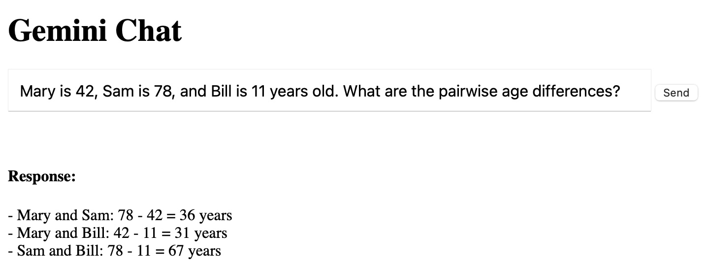

# A Web Application For Using the Google Gemini APIs

Here we look at a web application using the Google Gemini API for chat
We'll show the complete program listing that demonstrates how to interact with Gemini, providing a foundation for building more complex applications. This example code encapsulates the core concepts of sending requests and processing responses, showcasing Haskell's ability to integrate with modern APIs while maintaining code clarity and robustness.

This example is in the directory **haskell_tutorial_cookbook_examples/webchat**.

Our focus will be on understanding the data structures used to represent Gemini requests and responses, as well as the HTTP client functionality employed to communicate with the API. We'll explore how Haskell's type system aids in constructing well-defined requests and how its data handling capabilities simplify the parsing of complex JSON responses. Through this exploration, you'll gain valuable insights into leveraging Haskell's strengths for real-world API interactions.

Beyond the immediate application of the Gemini API, this chapter serves as a template for interacting with web services in Haskell. The techniques and patterns discussed here can be readily adapted to other APIs and use cases. By the end of this chapter, you'll be equipped with the knowledge and tools to confidently integrate Haskell into your projects that involve communication with external services, opening up a world of possibilities for building robust and scalable applications.

Here is an example of the web app:

{width=60%}


**NOTE: I had to add "debug printout" to this example to get the API calls working correctly. I decided to leave the debug printout in the code so when you run the web app you can see what the request and response data looks like.**

You need a Google API key to run this example. Set the environment variable **GOOGLE_API_KEY** to your key.

This Haskell code defines data types for interacting with the Google Gemini API and sets up a simple web server using the Scotty framework:

```haskell{line-numbers: false}
import Web.Scotty
import Network.HTTP.Client.TLS (tlsManagerSettings)
import Network.HTTP.Client
import Network.HTTP.Types.Status (status500)
import qualified Data.ByteString.Char8 as BS
import qualified Data.Text.Lazy as TL
import qualified Data.Aeson as Aeson
import Data.Aeson (FromJSON, ToJSON)
import GHC.Generics
import qualified Data.Text as T
import System.IO (hFlush, stdout)
import System.Environment (getEnv)
import qualified Data.Vector as V

data GeminiRequest = GeminiRequest
  { prompt :: String
  } deriving (Show, Generic, FromJSON, ToJSON)

data GeminiResponse = GeminiResponse
  { candidates :: [Candidate]
  , promptFeedback :: Maybe PromptFeedback
  } deriving (Show, Generic, FromJSON, ToJSON)

data Candidate = Candidate
  { content :: Content2
  , finishReason :: Maybe String
  , index :: Maybe Int
  } deriving (Show, Generic, FromJSON, ToJSON)

data Content2 = Content2
  { parts :: [Part]
  , role :: Maybe String
  } deriving (Show, Generic, FromJSON, ToJSON)

data Part = Part
  { text :: String
  } deriving (Show, Generic, FromJSON, ToJSON)

data PromptFeedback = PromptFeedback
  { blockReason :: Maybe String
  , safetyRatings :: Maybe [SafetyRating]
  } deriving (Show, Generic, FromJSON, ToJSON)

data SafetyRating = SafetyRating
  { category :: String
  , probability :: String
  } deriving (Show, Generic, FromJSON, ToJSON)
```

There are two parts to function **main**. The first part defined the template for showing a HTML input form with embedded JavaScript:

```haskell{line-numbers: false}
main :: IO ()
main = do
  apiKey <- getEnv "GOOGLE_API_KEY"
  scotty 3000 $ do
    get "/" $ do
      html $ TL.pack
        "<!DOCTYPE html>\
        \<html>\
        \<head>\
        \<title>Gemini Chat</title>\
        \</head>\
        \<body>\
        \  <h1>Gemini Chat</h1>\
        \  <form id='chat-form'>\
        \    <input type='text' id='prompt' name='prompt' placeholder='Enter your prompt'\
        \           style='width: 70%; padding: 10px; font-size: 16px;'>\
        \    <button type='submit'>Send</button>\
        \  </form><br/><br/><h4>Response:</h4>\
        \  <div id='response'></div>\
        \  <script>\
        \   const form = document.getElementById('chat-form');\
        \   const responseDiv = document.getElementById('response');\
        \   form.addEventListener('submit', async (event) => {\
        \     event.preventDefault();\
        \     const prompt = document.getElementById('prompt').value;\
        \     try {\
        \       const response = await fetch('/chat', {\
        \         method: 'POST',\
        \         headers: { 'Content-Type': 'application/json' },\
        \         body: JSON.stringify({ prompt: prompt })\
        \       });\
        \       const data = await response.json();\
        \       responseDiv.innerText = data.text;\
        \     } catch (error) {\
        \       console.error('Error:', error);\
        \       responseDiv.innerText = 'Error occurred while fetching response';\
        \     }\
        \   });\
        \  </script>\
        \</body>\
        \</html>"
```

The second part of function **main** defines the HTTP POST processing. When a user clicks the **submit** button on the web page This handler is called by the JavaScript embedded on the web page:

```haskell{line-numbers: false}
    post "/chat" $ do
      req <- jsonData :: ActionM GeminiRequest
      liftIO $ putStrLn $ "Received request: " ++ show req
      liftIO $ hFlush stdout

      manager <- liftIO $ newManager tlsManagerSettings

      initialRequest <- liftIO $ parseRequest 
        "https://generativelanguage.googleapis.com/v1/models/gemini-pro:generateContent"

      let geminiRequestBody = Aeson.object
            [ ("contents", Aeson.Array $ V.singleton $ Aeson.object
                [ ("parts", Aeson.Array $ V.singleton $ Aeson.object
                    [ ("text", Aeson.String $ T.pack $ prompt req)
                    ]
                  )
                ]
              )
            , ("generationConfig", Aeson.object
                [ ("temperature", Aeson.Number 0.1)
                , ("maxOutputTokens", Aeson.Number 800)

                ]
              )
            ]

      let request2 = initialRequest
            { requestHeaders =
                [ ("Content-Type", "application/json")
                , ("x-goog-api-key", BS.pack apiKey)
                ]
            , method = "POST"
            , requestBody = RequestBodyLBS $ Aeson.encode geminiRequestBody
            }

      liftIO $ putStrLn $ "Request body: " ++ show (Aeson.encode geminiRequestBody)
      liftIO $ hFlush stdout

      response2 <- liftIO $ httpLbs request2 manager
      liftIO $ do
        putStrLn $ "Response status: " ++ show (responseStatus response2)
        putStrLn $ "Response headers: " ++ show (responseHeaders response2)
        putStrLn $ "Raw response: " ++ show (responseBody response2)
        hFlush stdout

      let maybeGeminiResponse = Aeson.decode (responseBody response2) :: Maybe GeminiResponse
      
      liftIO $ putStrLn $ "Parsed response: " ++ show maybeGeminiResponse  -- Debug print
      liftIO $ hFlush stdout

      case maybeGeminiResponse of
        Just geminiResponse -> do
          case candidates geminiResponse of
            (candidate:_) -> do
              case parts (content candidate) of
                (part:_) -> do
                  liftIO $ putStrLn $ "Sending response: " ++ show part
                  liftIO $ hFlush stdout
                  json part
                [] -> do
                  liftIO $ putStrLn "No parts in response"
                  status status500 >> Web.Scotty.text "No content in response"
            [] -> do
              liftIO $ putStrLn "No candidates in response"
              status status500 >> Web.Scotty.text "No candidates in response"
        Nothing -> do
          liftIO $ putStrLn "Failed to parse response"
          status status500 >> Web.Scotty.text "Failed to parse Gemini response"                ]
              )
            ]

      let request2 = initialRequest
            { requestHeaders =
                [ ("Content-Type", "application/json")
                , ("x-goog-api-key", BS.pack apiKey)
                ]
            , method = "POST"
            , requestBody = RequestBodyLBS $ Aeson.encode geminiRequestBody
            }

      liftIO $ putStrLn $ "Request body: " ++ show (Aeson.encode geminiRequestBody)
      liftIO $ hFlush stdout

      response2 <- liftIO $ httpLbs request2 manager
      liftIO $ do
        putStrLn $ "Response status: " ++ show (responseStatus response2)
        putStrLn $ "Response headers: " ++ show (responseHeaders response2)
        putStrLn $ "Raw response: " ++ show (responseBody response2)
        hFlush stdout

      let maybeGeminiResponse = Aeson.decode (responseBody response2) :: Maybe GeminiResponse
      
      liftIO $ putStrLn $ "Parsed response: " ++ show maybeGeminiResponse  -- Debug print
      liftIO $ hFlush stdout

      case maybeGeminiResponse of
        Just geminiResponse -> do
          case candidates geminiResponse of
            (candidate:_) -> do
              case parts (content candidate) of
                (part:_) -> do
                  liftIO $ putStrLn $ "Sending response: " ++ show part
                  liftIO $ hFlush stdout
                  json part
                [] -> do
                  liftIO $ putStrLn "No parts in response"
                  status status500 >> Web.Scotty.text "No content in response"
            [] -> do
              liftIO $ putStrLn "No candidates in response"
              status status500 >> Web.Scotty.text "No candidates in response"
        Nothing -> do
          liftIO $ putStrLn "Failed to parse response"
          status status500 >> Web.Scotty.text "Failed to parse Gemini response"
```


## Web App Wrap Up and a Description of Scotty Web Framework

Scotty is a lightweight and expressive Haskell web framework that draws inspiration from Ruby's Sinatra. It emphasizes simplicity and ease of use, making it a great choice for beginners and small projects. With Scotty, you can quickly define routes, handle requests, and generate responses with minimal boilerplate code. Its concise syntax and focus on core web development concepts allow developers to focus on building their application logic without getting bogged down in framework complexities.   

Furthermore, Scotty leverages Haskell's powerful type system to provide compile-time guarantees and enhanced code safety. This helps catch errors early in the development process and promotes maintainable code.

Scotty is built on top of the efficient WAI (Web Application Interface) standard, ensuring compatibility with a wide range of middleware and extensions. This allows developers to easily integrate Scotty with existing Haskell libraries and tools, extending its functionality to meet the needs of more complex applications.
 
This is a simple web app but I hope, dear reader, that it is a useful example and a good jumping off point for your own web app projects. This example also serves as an additional example in this book for using LLM APIs in Haskell applications.

