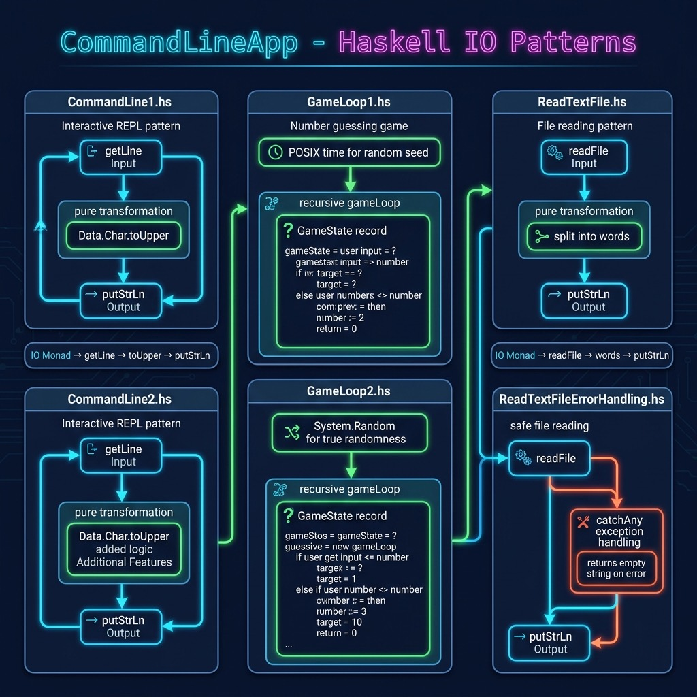

# Command Line Applications

**Book:** [Haskell Tutorial and Cookbook](https://leanpub.com/haskell-cookbook) by Mark Watson — [read free online](https://leanpub.com/haskell-cookbook/read)

**Book Chapter:** [Section 1 - Tutorial](https://leanpub.com/read/haskell-cookbook/section-1---tutorial)

A collection of small command-line programs demonstrating fundamental I/O patterns in Haskell: reading user input, processing text files, handling errors, and implementing an interactive game loop.

## Run

```bash
stack build --exec CommandLine1
```

Other executables in this project:

```bash
stack build --exec CommandLine2
stack build --exec GameLoop1
stack build --exec GameLoop2
stack build --exec ReadTextFile
stack build --exec ReadTextFileErrorHandling
```



## Source Files

| File | Description |
|------|-------------|
| `CommandLine1.hs` | Basic command-line I/O with `System.IO` |
| `CommandLine2.hs` | Variation on command-line input processing |
| `GameLoop1.hs` | Interactive game loop using `Data.Time` for timing |
| `GameLoop2.hs` | Alternative game loop implementation |
| `ReadTextFile.hs` | Reading and processing text files |
| `ReadTextFileErrorHandling.hs` | File I/O with error handling |

## License

Apache 2.0 — Copyright 2016-2026 Mark Watson. All rights reserved.
