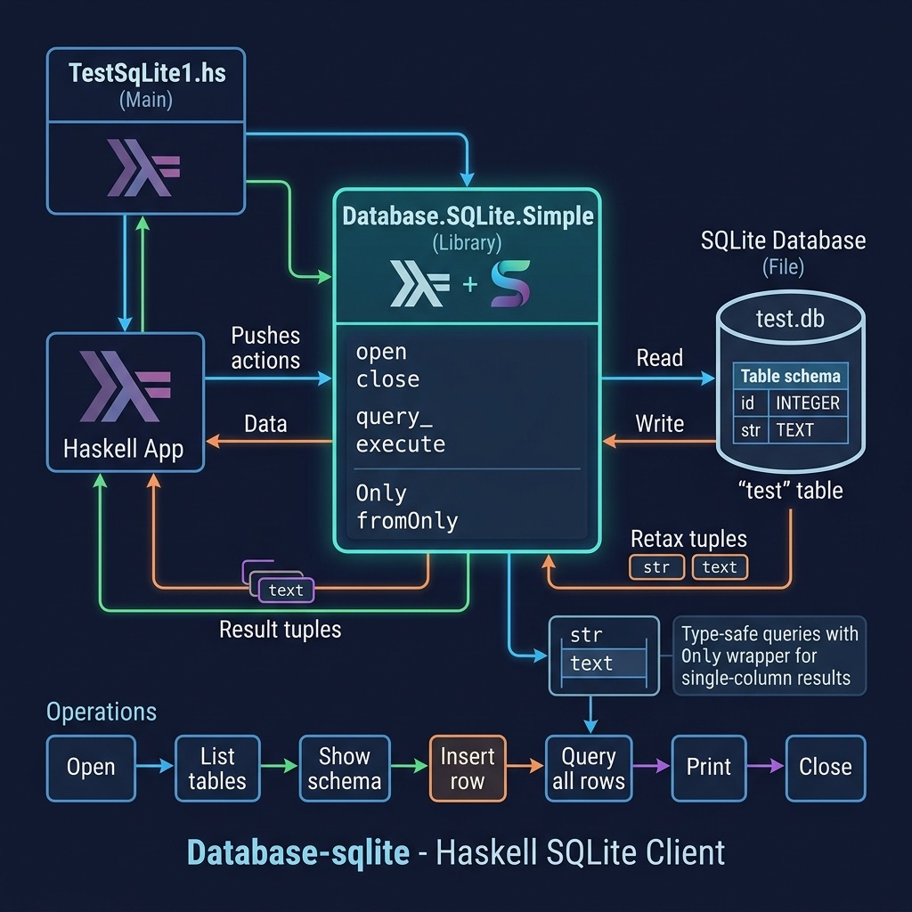

# SQLite Database Example

**Book:** [Haskell Tutorial and Cookbook](https://leanpub.com/haskell-cookbook) by Mark Watson — [read free online](https://leanpub.com/haskell-cookbook/read)

**Book Chapter:** [Using Relational Databases](https://leanpub.com/read/haskell-cookbook/using-relational-databases)

Demonstrates connecting to and querying a SQLite database from Haskell. This is a lightweight alternative to the PostgreSQL example — no server setup required, just a local file-based database.

## Prerequisites

SQLite3 must be installed on your system (it is pre-installed on macOS).

Create the test database:

```bash
sqlite3 test.db "CREATE TABLE test (id INTEGER PRIMARY KEY, str TEXT);"
```



## Run

Using Stack:

```bash
stack build --exec TestSqLite1
```

Using Cabal:

```bash
cabal build
cabal run
```

## License

Apache 2.0 — Copyright 2016-2026 Mark Watson. All rights reserved.