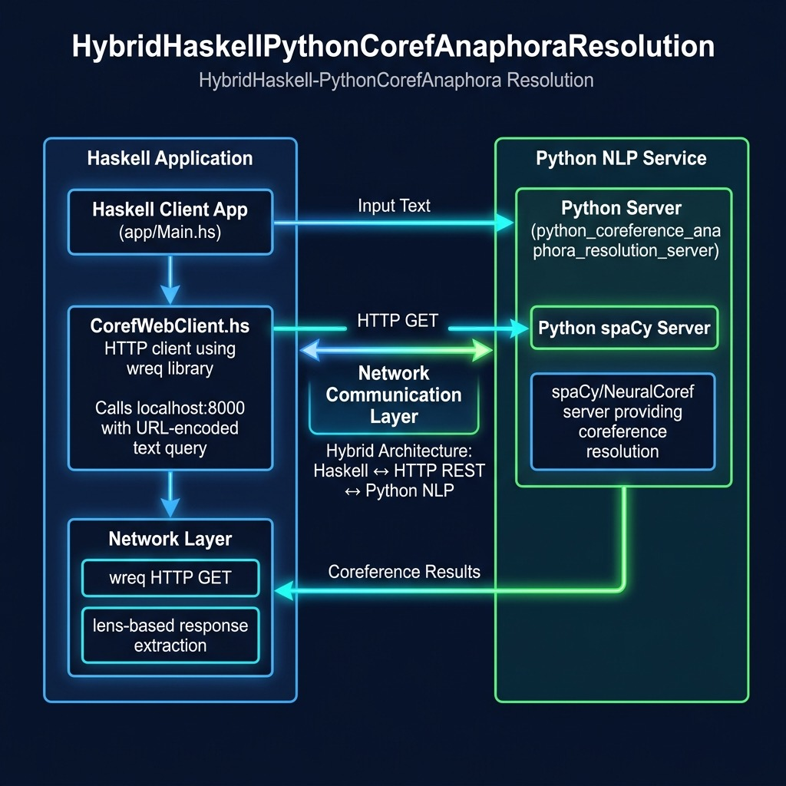

# Hybrid Haskell/Python Coreference and Anaphora Resolution

**Book:** [Haskell Tutorial and Cookbook](https://leanpub.com/haskell-cookbook) by Mark Watson — [read free online](https://leanpub.com/haskell-cookbook/read)

**Book Chapter:** [Hybrid Haskell and Python For Coreference Resolution](https://leanpub.com/read/haskell-cookbook/hybrid-haskell-and-python-for-coreference-resolution)

Demonstrates a hybrid architecture where a Haskell client calls a Python server that performs coreference and anaphora resolution using a BERT model with the spaCy NLP library. This is a practical example of combining Haskell's strengths in data processing with Python's rich ML ecosystem.




## Run

```bash
# In one terminal: start the Python server
cd python_coreference_anaphora_resolution_server
uv run coref_server.py

# In another terminal: run the Haskell client
stack build --fast --exec HybridHaskellPythonCorefAnaphoraResolution-exe
```

## License

Apache 2.0 — Copyright 2016-2026 Mark Watson. All rights reserved.
