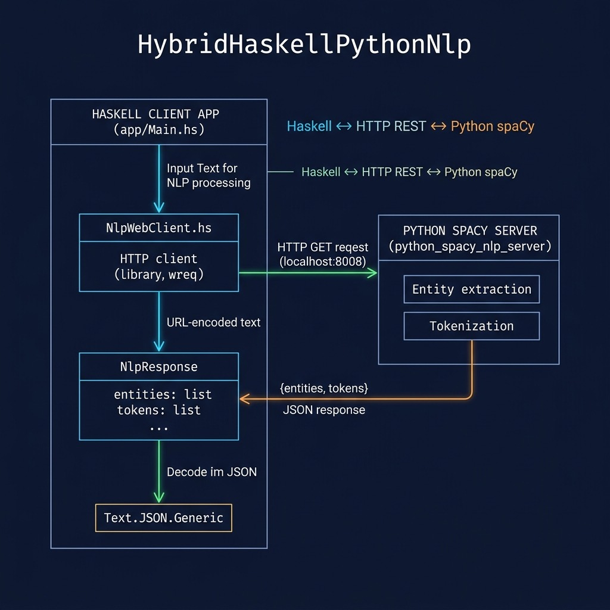

# Hybrid Haskell/Python NLP

**Book:** [Haskell Tutorial and Cookbook](https://leanpub.com/haskell-cookbook) by Mark Watson — [read free online](https://leanpub.com/haskell-cookbook/read)

**Book Chapter:** [Hybrid Haskell and Python Natural Language Processing](https://leanpub.com/read/haskell-cookbook/hybrid-haskell-and-python-natural-language-processing)

Demonstrates a hybrid NLP architecture: a Haskell client communicates with a Python server running spaCy for entity extraction, sentence segmentation, and other NLP tasks. This pattern lets you leverage Python's mature NLP libraries while keeping your main application logic in Haskell.

## Prerequisites

1. Start the Python spaCy server — see `python_spacy_nlp_server/README.md` for installation and setup instructions.
2. The Python server requires spaCy and a language model to be installed.



## Run

```bash
# In one terminal: start the Python server
cd python_spacy_nlp_server
uv run server_spacy.py

# In another terminal: run the Haskell client
stack build --fast --exec HybridHaskellPythonNlp-exe
```

## License

Apache 2.0 — Copyright 2016-2026 Mark Watson. All rights reserved.
