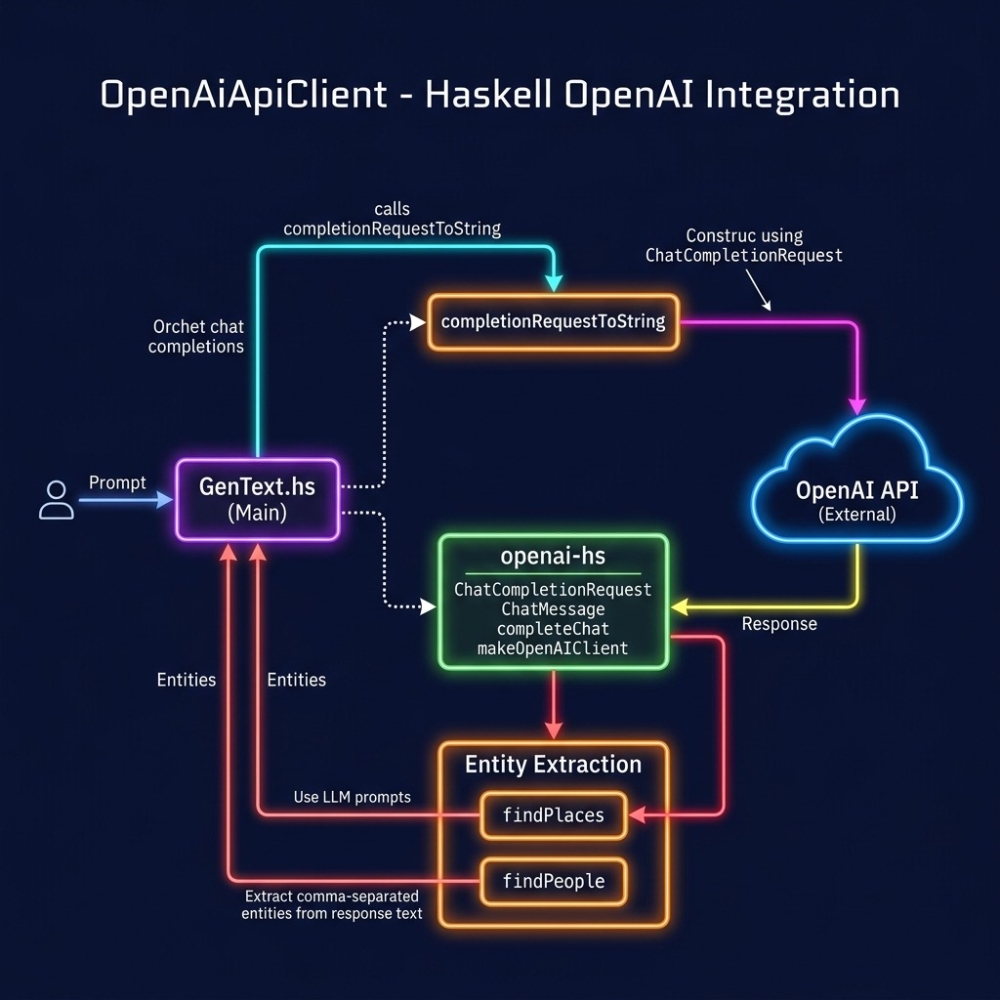

# OpenAI API Client

**Book:** [Haskell Tutorial and Cookbook](https://leanpub.com/haskell-cookbook) by Mark Watson — [read free online](https://leanpub.com/haskell-cookbook/read)

**Book Chapter:** [Using the OpenAI Large Language Model APIs in Haskell](https://leanpub.com/read/haskell-cookbook/using-the-openai-large-language-model-apis-in-haskell)

Demonstrates calling the OpenAI Chat Completion API from Haskell using the [openai-hs](https://github.com/agrafix/openai-hs) library by Alexander Thiemann. The example sends a prompt and pretty-prints the response text.

## Prerequisites

Set your OpenAI API key:

```bash
export OPENAI_API_KEY="sk-..."
```



## Run

Using Stack:

```bash
stack build
stack exec GenText
```

Using Cabal:

```bash
cabal build
cabal run
```

**Note:** You may need to run `cabal install cpphs` first if building with Cabal.

## License

Apache 2.0 — Copyright 2016-2026 Mark Watson. All rights reserved.
