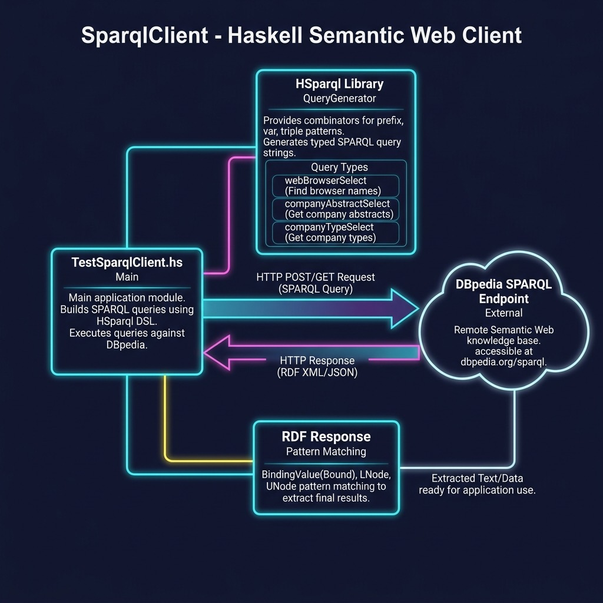

# SPARQL Client

**Book:** [Haskell Tutorial and Cookbook](https://leanpub.com/haskell-cookbook) by Mark Watson — [read free online](https://leanpub.com/haskell-cookbook/read)

**Book Chapter:** [Linked Data and the Semantic Web](https://leanpub.com/read/haskell-cookbook/linked-data-and-the-semantic-web)

Haskell clients for querying SPARQL endpoints and working with RDF data. Demonstrates HTTP-based SPARQL queries, JSON result parsing, and usage of the [RDF4H](https://github.com/robstewart57/rdf4h) library.

## Run

```bash
stack ghci
```

```haskell
:l HttpSparqlClient
main

:l RobsExample
main
```

> **Note:** The URI for the demo RDF file used in `RobsExample` is no longer valid, so that example will not run as-is.



## Source Files

| File | Description |
|------|-------------|
| `HttpSparqlClient.hs` | Queries a SPARQL endpoint over HTTP |
| `HttpSparqlJsonClient.hs` | SPARQL query with JSON response parsing |
| `RobsExample.hs` | RDF4H library example (demo URI no longer valid) |
| `JsonTest.hs` | JSON parsing utilities |
| `TestSparqlClient.hs` | Test harness for the SPARQL client |

## Further Reading

- [RDF4H documentation](https://robstewart57.github.io/rdf4h/)
- [RDF4H GitHub repository](https://github.com/robstewart57/rdf4h)

## License

Apache 2.0 — Copyright 2016-2026 Mark Watson. All rights reserved.
