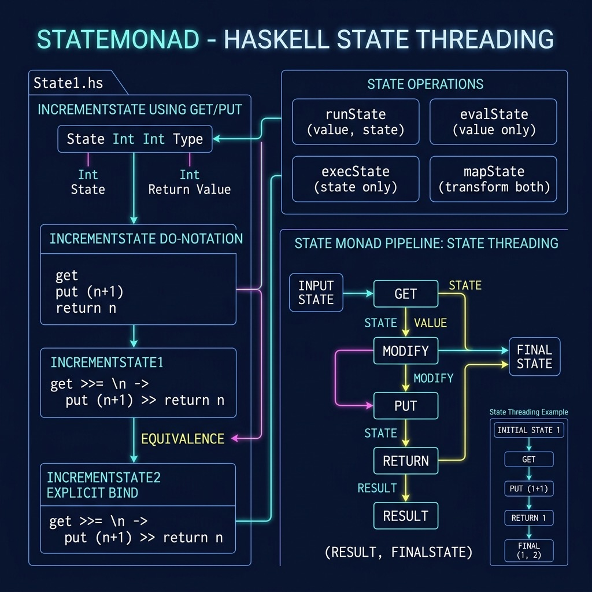

# State Monad Example

**Book:** [Haskell Tutorial and Cookbook](https://leanpub.com/haskell-cookbook) by Mark Watson — [read free online](https://leanpub.com/haskell-cookbook/read)

**Book Chapter:** [Tutorial on Pure Haskell Programming](https://leanpub.com/read/haskell-cookbook/tutorial-on-pure-haskell-programming)

A concise example demonstrating the State Monad (`Control.Monad.State`). Shows how to thread mutable state through a sequence of computations in a purely functional way using `get`, `put`, and `runState`.



## Run

```bash
stack build
stack exec State1
```

## License

Apache 2.0 — Copyright 2016-2026 Mark Watson. All rights reserved.
