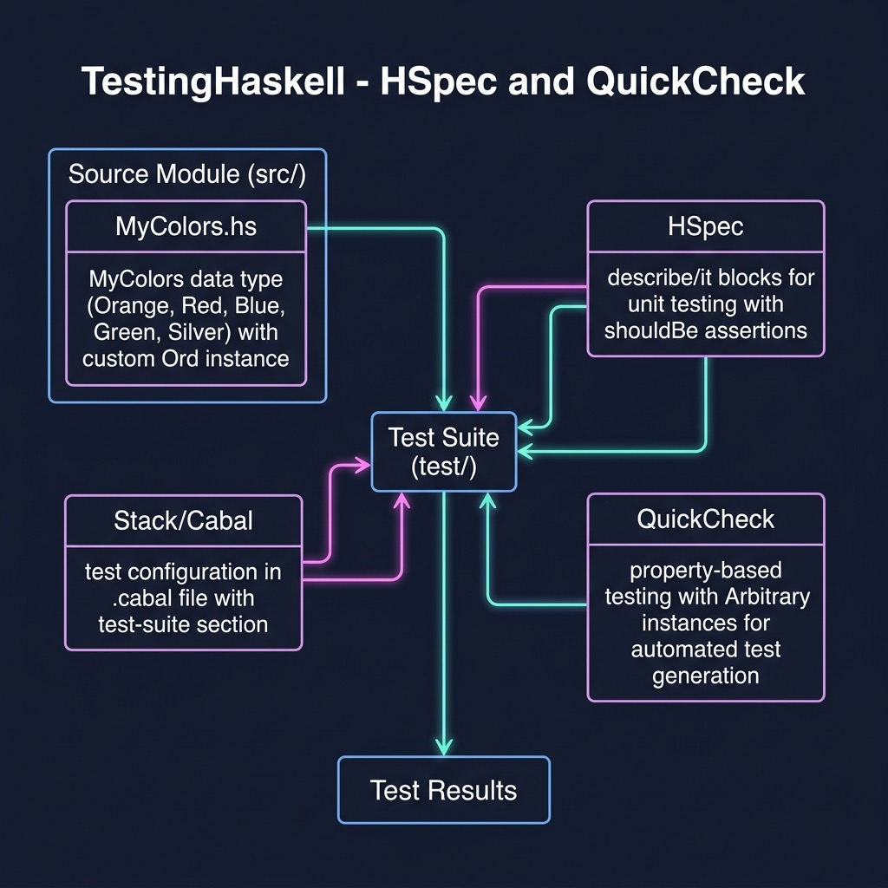

# Testing Haskell

**Book:** [Haskell Tutorial and Cookbook](https://leanpub.com/haskell-cookbook) by Mark Watson — [read free online](https://leanpub.com/haskell-cookbook/read)

**Book Chapter:** [Section 1 - Tutorial](https://leanpub.com/read/haskell-cookbook/section-1---tutorial)

Demonstrates unit testing in Haskell using HUnit and/or QuickCheck. The project defines a simple `MyColors` module with a custom `Ord` instance and includes tests — one of the three tests is intentionally designed to fail, showing how test frameworks report failures.

## Run

```bash
stack test
```

> **Note:** One of the three tests is expected to fail — this is intentional to demonstrate test failure output.



## Project Structure

| Path | Description |
|------|-------------|
| `src/MyColors.hs` | Module under test: custom color type with `Ord` instance |
| `app/Main.hs` | Main executable entry point |
| `test/` | Test suite |

## License

Apache 2.0 — Copyright 2016-2026 Mark Watson. All rights reserved.
