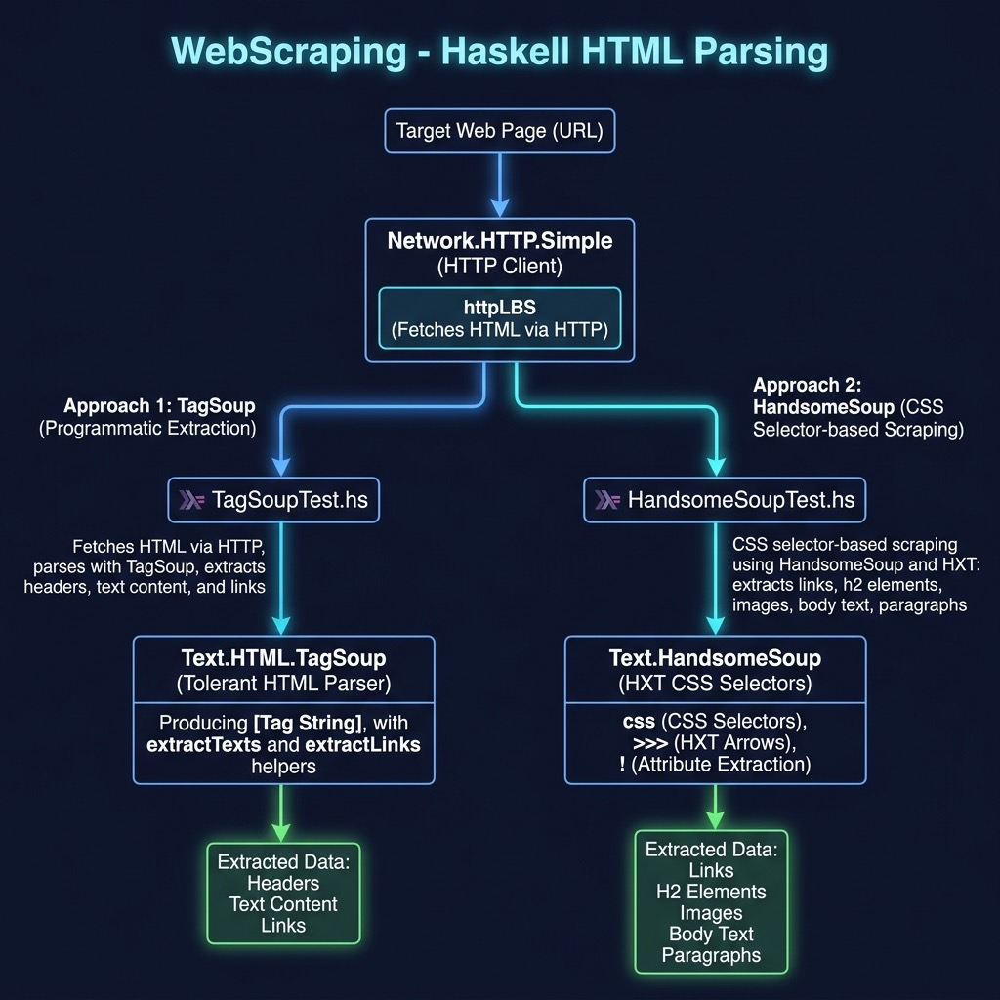

# Web Scraping

**Book:** [Haskell Tutorial and Cookbook](https://leanpub.com/haskell-cookbook) by Mark Watson — [read free online](https://leanpub.com/haskell-cookbook/read)

**Book Chapter:** [Web Scraping](https://leanpub.com/read/haskell-cookbook/web-scraping)

Demonstrates web scraping in Haskell using the TagSoup library for HTML parsing. The example fetches a web page over HTTP and extracts structured data from the HTML.

## Run

Using Stack:

```bash
stack build --exec TagSoupTest
```

Using Cabal:

```bash
cabal build
cabal run TagSoupTest
```



## Source Files

| File | Description |
|------|-------------|
| `TagSoupTest.hs` | Web scraping with TagSoup HTML parser |
| `HandsomeSoupTest.hs` | Alternative scraping with HandsomeSoup (CSS selectors) |

## License

Apache 2.0 — Copyright 2016-2026 Mark Watson. All rights reserved.
